# Shuttly UML Diagrams

This document contains all UML diagrams for the Shuttly smart shuttle tracking and fare enforcement system.

---

## 1. Use Case Diagram

```mermaid
flowchart TB
    subgraph Shuttly System
        subgraph Student Use Cases
            UC1[Register/Login]
            UC2[View Dashboard]
            UC3[Scan QR - Tap In]
            UC4[Scan QR - Tap Out]
            UC5[View Wallet Balance]
            UC6[View Transaction History]
            UC7[View Ride History]
            UC8[Track Shuttle on Map]
        end

        subgraph Driver Use Cases
            UC9[Start Route]
            UC10[Broadcast GPS Location]
            UC11[End Route]
            UC12[View Assigned Shuttle]
        end

        subgraph Admin Use Cases
            UC13[Manage Routes - CRUD]
            UC14[Manage Stops - CRUD]
            UC15[Configure Fare Matrix]
            UC16[Manage Shuttles - CRUD]
            UC17[Assign Driver to Shuttle]
            UC18[Manage Users]
            UC19[Top-up User Wallet]
            UC20[View Ride Logs]
            UC21[View Analytics Dashboard]
            UC22[Generate QR Codes]
        end

        subgraph System Use Cases
            UC23[Calculate Fare]
            UC24[Deduct Wallet Balance]
            UC25[Detect Incomplete Rides]
            UC26[Apply Penalty]
            UC27[Record Transaction]
        end
    end

    Student((Student))
    Driver((Driver))
    Admin((Admin))
    System((System))

    Student --> UC1
    Student --> UC2
    Student --> UC3
    Student --> UC4
    Student --> UC5
    Student --> UC6
    Student --> UC7
    Student --> UC8

    Driver --> UC1
    Driver --> UC9
    Driver --> UC10
    Driver --> UC11
    Driver --> UC12

    Admin --> UC1
    Admin --> UC13
    Admin --> UC14
    Admin --> UC15
    Admin --> UC16
    Admin --> UC17
    Admin --> UC18
    Admin --> UC19
    Admin --> UC20
    Admin --> UC21
    Admin --> UC22

    System --> UC23
    System --> UC24
    System --> UC25
    System --> UC26
    System --> UC27

    UC4 -.->|includes| UC23
    UC23 -.->|includes| UC24
    UC24 -.->|includes| UC27
    UC25 -.->|includes| UC26
    UC26 -.->|includes| UC27
```

### Use Case Descriptions

| ID | Use Case | Actor | Description |
|----|----------|-------|-------------|
| UC1 | Register/Login | All | User authentication with email/password |
| UC2 | View Dashboard | Student | See active shuttles, wallet balance, active ride |
| UC3 | Scan QR - Tap In | Student | Scan stop QR code to start a ride |
| UC4 | Scan QR - Tap Out | Student | Scan stop QR code to end a ride |
| UC5 | View Wallet Balance | Student | Check current wallet balance |
| UC6 | View Transaction History | Student | View all wallet transactions |
| UC7 | View Ride History | Student | View past rides with fares |
| UC8 | Track Shuttle on Map | Student | Real-time shuttle location tracking |
| UC9 | Start Route | Driver | Begin GPS broadcasting for assigned route |
| UC10 | Broadcast GPS Location | Driver | Send location updates every 3 seconds |
| UC11 | End Route | Driver | Stop GPS broadcasting |
| UC12 | View Assigned Shuttle | Driver | See shuttle and route assignment |
| UC13 | Manage Routes | Admin | Create, read, update, delete routes |
| UC14 | Manage Stops | Admin | CRUD stops with map coordinates |
| UC15 | Configure Fare Matrix | Admin | Set fares between stops |
| UC16 | Manage Shuttles | Admin | CRUD shuttle vehicles |
| UC17 | Assign Driver to Shuttle | Admin | Link drivers to shuttles |
| UC18 | Manage Users | Admin | View and edit user roles |
| UC19 | Top-up User Wallet | Admin | Add funds to user wallets |
| UC20 | View Ride Logs | Admin | See all rides with filters |
| UC21 | View Analytics Dashboard | Admin | System overview statistics |
| UC22 | Generate QR Codes | Admin | Create QR codes for stops |
| UC23 | Calculate Fare | System | Compute fare based on entry/exit stops |
| UC24 | Deduct Wallet Balance | System | Subtract fare from wallet |
| UC25 | Detect Incomplete Rides | System | Find rides without tap-out after timeout |
| UC26 | Apply Penalty | System | Charge penalty for incomplete rides |
| UC27 | Record Transaction | System | Log all wallet transactions |

---

## 2. Sequence Diagrams

### 2.1 Student Tap-In Flow

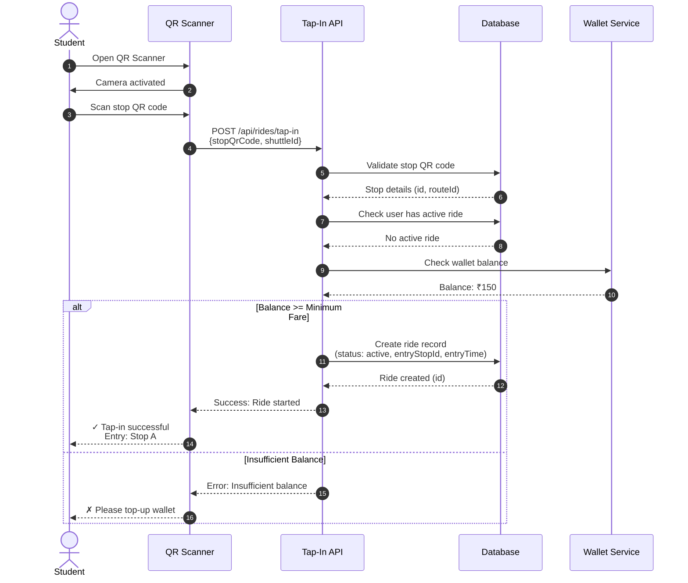

### 2.2 Student Tap-Out Flow

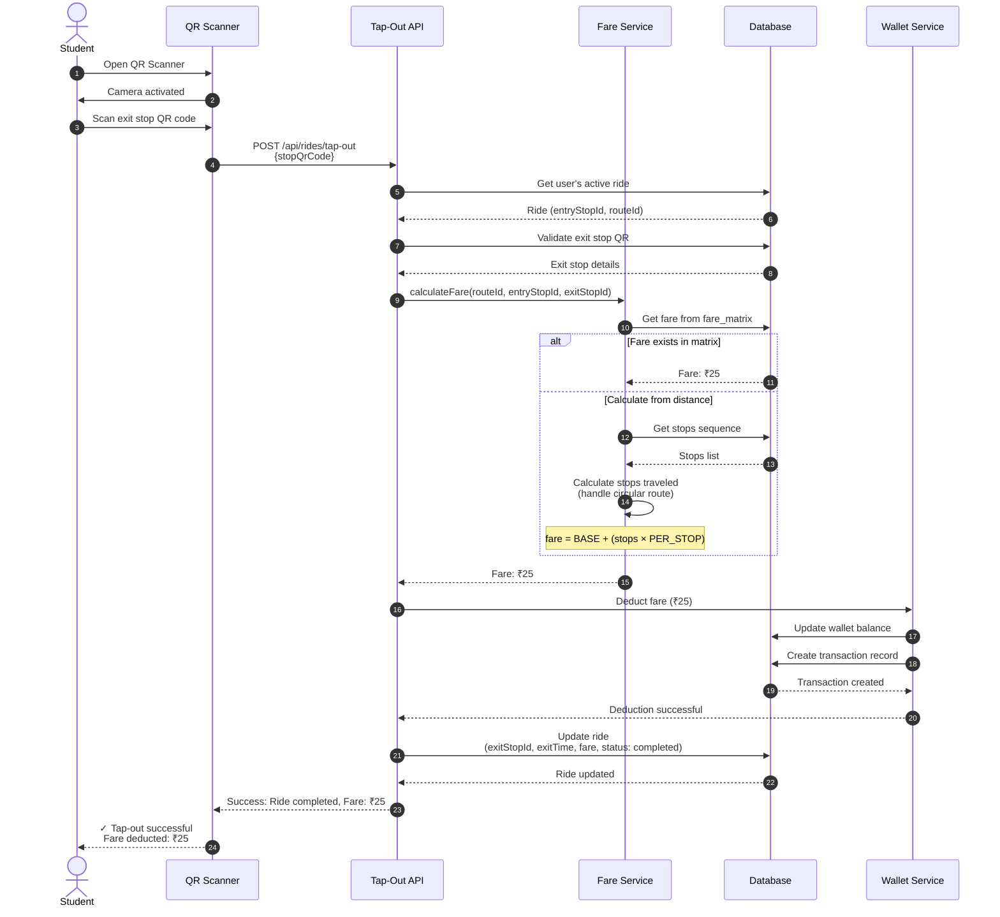

### 2.3 Driver GPS Broadcasting Flow

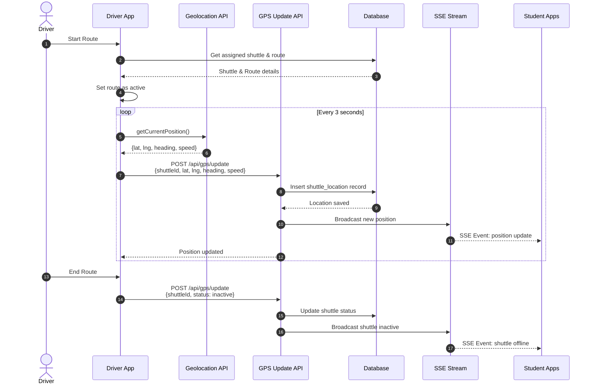

### 2.4 Incomplete Ride Penalty Flow

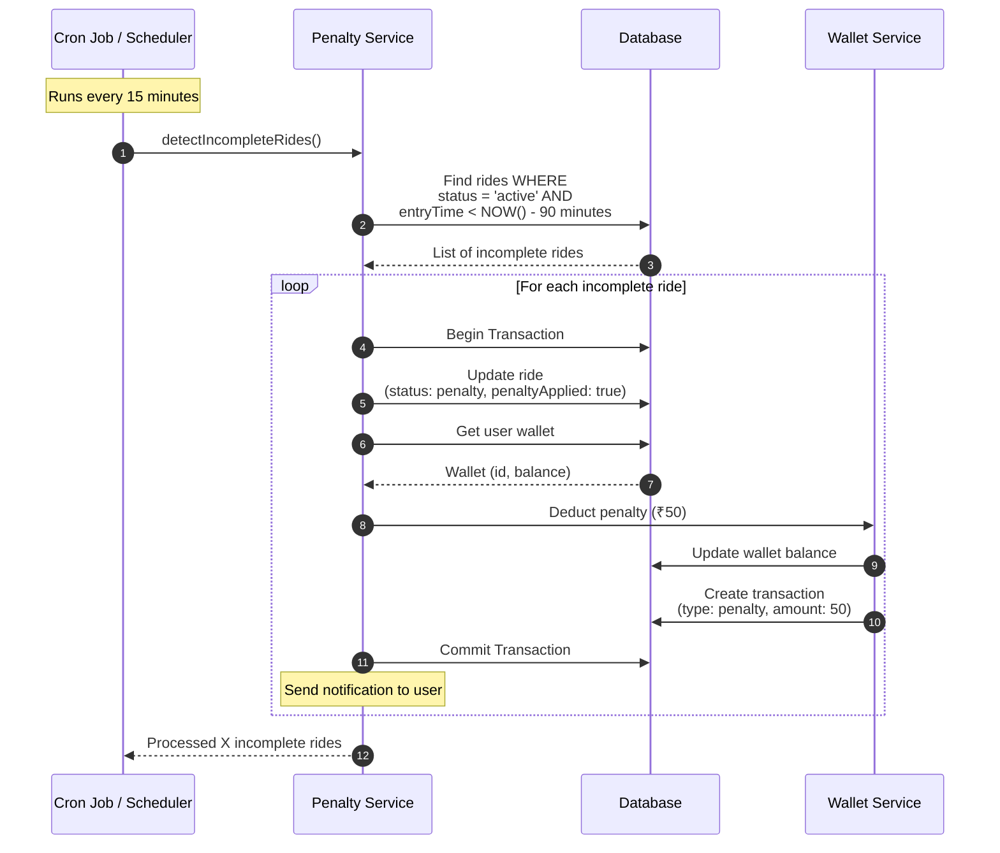

### 2.5 Admin Wallet Top-up Flow

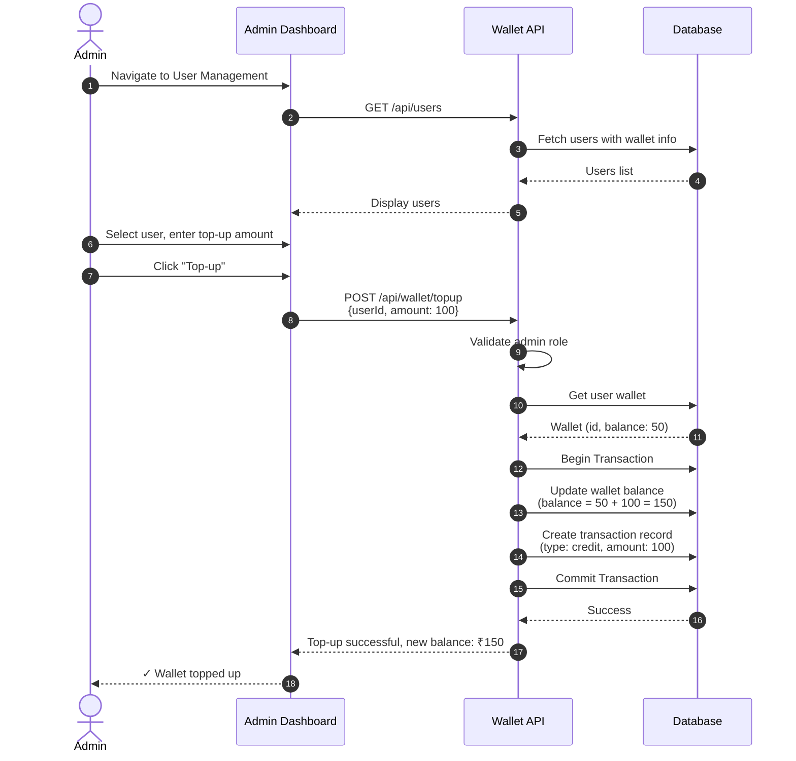

---

## 3. Class Diagram

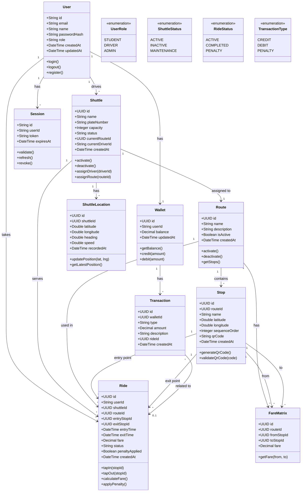

### Class Descriptions

| Class | Description |
|-------|-------------|
| **User** | System user with role-based access (student, driver, admin) |
| **Wallet** | User's digital wallet for fare payments |
| **Transaction** | Record of wallet credits, debits, and penalties |
| **Shuttle** | Physical shuttle vehicle with capacity and status |
| **Route** | Circular shuttle route containing ordered stops |
| **Stop** | Physical stop location with QR code for tap-in/out |
| **FareMatrix** | Fare configuration between two stops on a route |
| **Ride** | Record of a student's journey from entry to exit |
| **ShuttleLocation** | GPS position record for real-time tracking |
| **Session** | User authentication session managed by Better Auth |

---

## 4. State Diagrams

### 4.1 Ride State Diagram

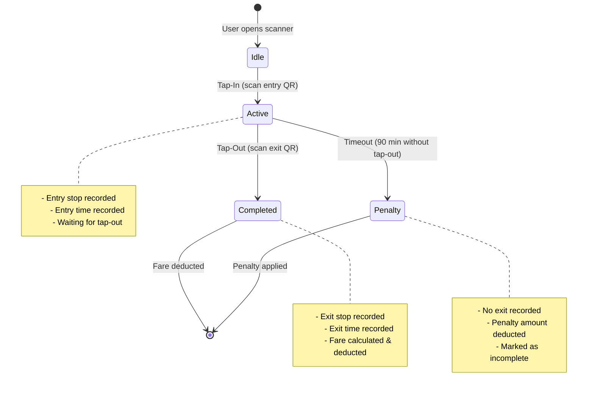

### 4.2 Shuttle State Diagram

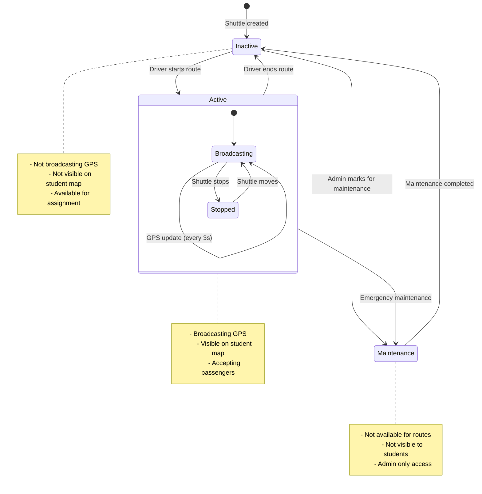

### 4.3 Wallet Transaction State Diagram

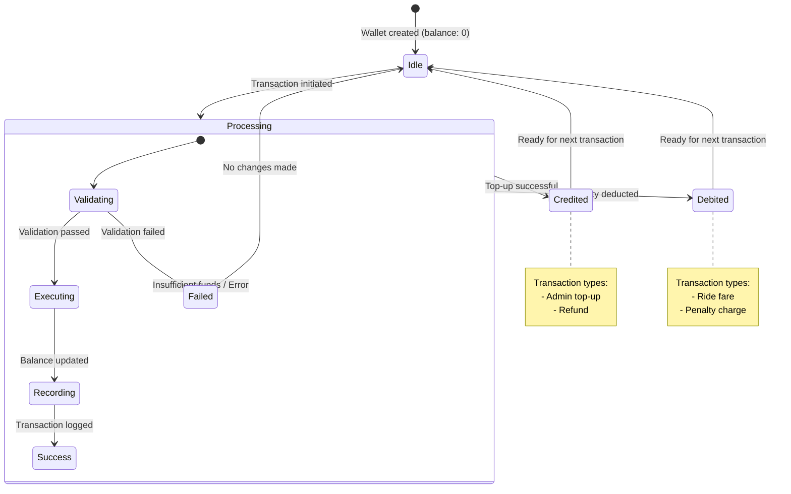

### 4.4 User Authentication State Diagram

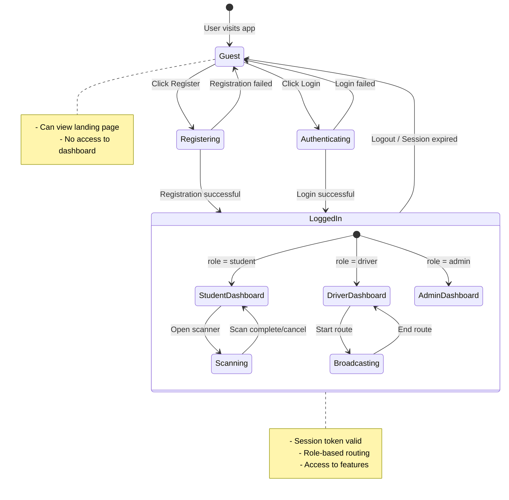

### 4.5 Route Management State Diagram

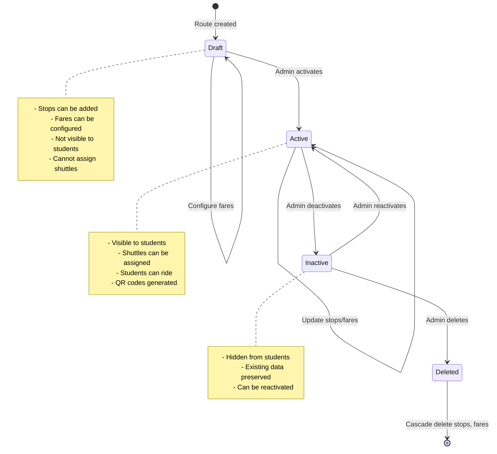

---

## Summary

| Diagram Type | Count | Purpose |
|--------------|-------|---------|
| Use Case | 1 | Shows all actors and their interactions with the system |
| Sequence | 5 | Details the flow of key operations (tap-in, tap-out, GPS, penalty, top-up) |
| Class | 1 | Defines all entities, attributes, methods, and relationships |
| State | 5 | Shows lifecycle states for Ride, Shuttle, Wallet, User Auth, and Route |

These diagrams provide a complete blueprint for implementing the Shuttly system.
